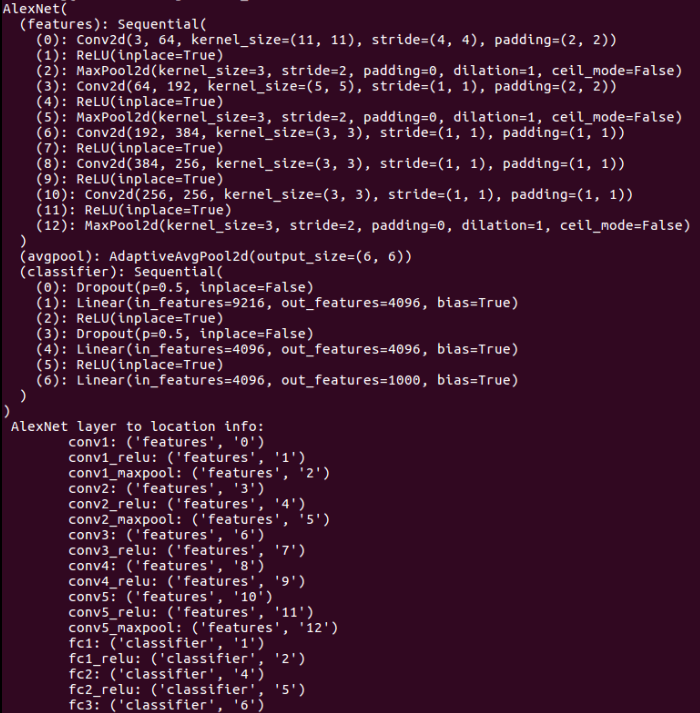
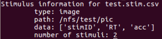
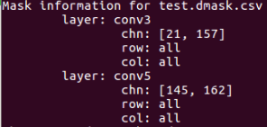
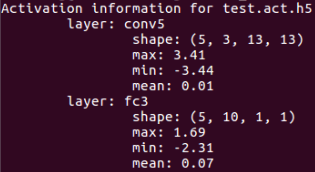
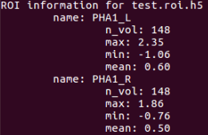
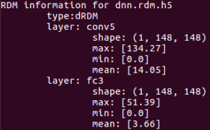

Name
----

db_info - Provide important information of specific dnn or file

Synopsis
--------

db_info filename/netname

Arguments
---------

Required Position Arguments
~~~~~~~~~~~~~~~~~~~~~~~~~~~

+-----------------------------+----------------------------------------+
| Argument                    | Discription                            |
+=============================+========================================+
| name                        | Filename or Netname.Filename only      |
|                             | support suffix with                    |
|                             | ‘.stim.csv’,‘.dmask.csv’,‘.act.h5’,‘.r |
|                             | oi.h5’,‘.rdm.h5’.Remember              |
|                             | to run this command in the right path  |
|                             | or it can’t find your file.Netname     |
|                             | only support ‘AlexNet’, ‘VggFace’,     |
|                             | ‘Vgg11’                                |
+-----------------------------+----------------------------------------+

Examples
--------

Check for dnn information
~~~~~~~~~~~~~~~~~~~~~~~~~

Provide dnn’s structure parameters and layer to location information

::

   db_info AlexNet

The output information is displayed as below:

.. raw:: html

   

|AlexNet|

.. raw:: html

   

Check for file information
~~~~~~~~~~~~~~~~~~~~~~~~~~

.stim.csv
^^^^^^^^^

Provide information of stimuli type, path, data types and number of
stimuli.

::

   db_info test.stim.csv

The output information is displayed as below:

.. raw:: html

   

|stim|

.. raw:: html

   

.dmask.csv
^^^^^^^^^^

Provide information of mask layer, chn, row and column.

::

   db_info test.dmask.csv

The output information is displayed as below:

.. raw:: html

   

|dmask|

.. raw:: html

   

.act.h5
^^^^^^^

Provide activation shape in different layers and its statistical
information.

::

   db_info test.act.h5

The output information is displayed as below:

.. raw:: html

   

|act|

.. raw:: html

   

.roi.h5
^^^^^^^

Provide ROI names, data shape of brain response and its statistical
information.

::

   db_info test.roi.h5

The output information is displayed as below:

.. raw:: html

   

|roi|

.. raw:: html

   

.rdm.h5
^^^^^^^

Provide representation distance matrices (RDMs) shape for DNN activation
and brain activation and their statistical information.

::

   # Checking information for RDM type of brain
   db_info brain.rdm.h5

The output information is displayed as below:

.. raw:: html

   

|brdm|

.. raw:: html

   

::

   # Checking information for RDM type of dnn
   db_info dnn.rdm.h5

The output information is displayed as below:

.. raw:: html

   

|drdm|

.. raw:: html

   

.. |brdm| image:: ../../img/brain_rdm_info.png

