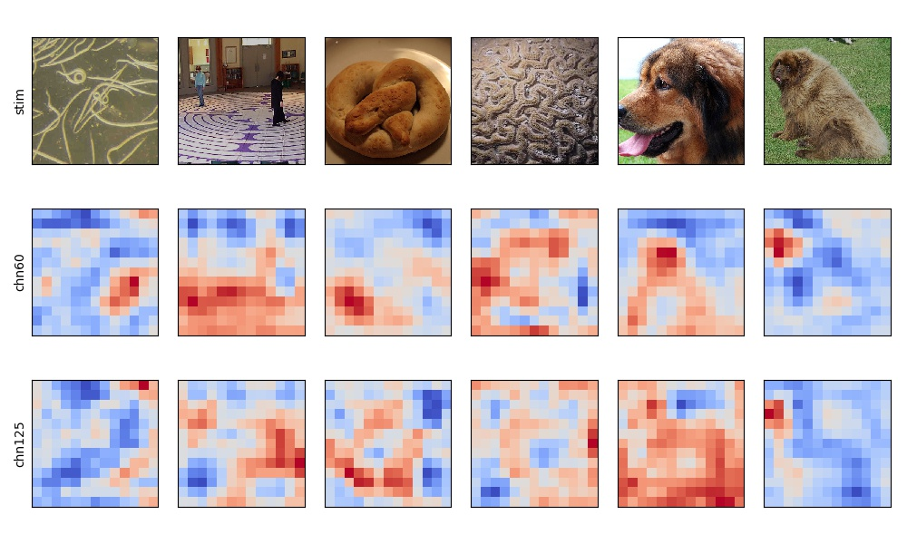

Name
----

dnn_view - Visualize feature maps of stimuli.

Synopsis
--------

dnn_view -net Net -layer Layer [Layer …] -chn Channel [Channel …] [-cmap
Colormap] [-vmin Vmin] [-vmax Vmax] [-show] -out Output

Arguments
---------

Required Arguments
~~~~~~~~~~~~~~~~~~

+-----------------------------+----------------------------------------+
| Argument                    | Discription                            |
+=============================+========================================+
| net                         | Name of DNN Model, which should be     |
|                             | placed in $DNNBRAIN_DATA/models with   |
|                             | format \*.pth.                         |
+-----------------------------+----------------------------------------+
| layer                       | Convolution layers used to specify     |
|                             | where activation is extracted          |
|                             | from.E.g., ‘conv1’ represents the      |
|                             | first convolution layerOnly support    |
|                             | convolution layer!                     |
+-----------------------------+----------------------------------------+
| chn                         | Channel numbers used to specify which  |
|                             | channels are used to.Channel index     |
|                             | starts from 1.Don’t support view more  |
|                             | than 5 channels at once!               |
+-----------------------------+----------------------------------------+
| stim                        | A .stim.csv file which contains        |
|                             | stimulus information                   |
+-----------------------------+----------------------------------------+

Optional Arguments
~~~~~~~~~~~~~~~~~~

+-----------------------------+----------------------------------------+
| Argument                    | Discription                            |
+=============================+========================================+
| cmap                        | Show feature maps with the specified   |
|                             | colormap.Default is ‘colorwarm’.       |
+-----------------------------+----------------------------------------+
| vmin                        | The minimal value used in colormap is  |
|                             | applied in all feature maps.Default is |
|                             | the minimal value of each feature map  |
|                             | for itself.                            |
+-----------------------------+----------------------------------------+
| vmax                        | The maximal value used in colormap is  |
|                             | applied in all feature maps.Default is |
|                             | the maximal value of each feature map  |
|                             | for itself.                            |
+-----------------------------+----------------------------------------+
| show                        | If used, display stimuli and feature   |
|                             | maps in figures.                       |
+-----------------------------+----------------------------------------+

Outputs
-------

A .jpg image visualizing the original stimulus and the feature maps of
required net information.

Examples
--------

::

   dnn_view -net AlexNet -layer conv5 -chn 60 125 -stim ./test.stim.csv -show -out ./dnn_view.act.h5

The output image is displayed as below:

.. raw:: html

   

|view|

.. raw:: html

   

