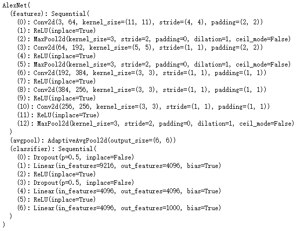
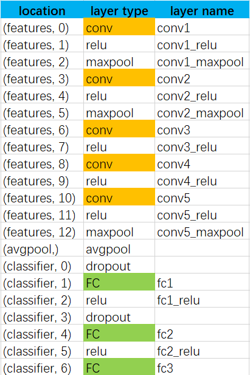
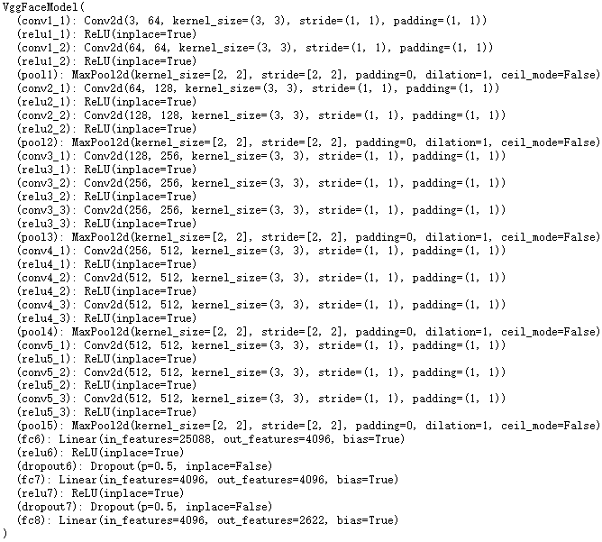
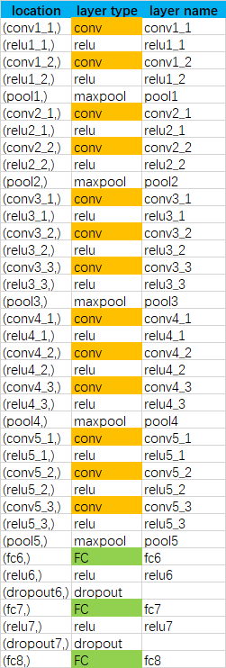
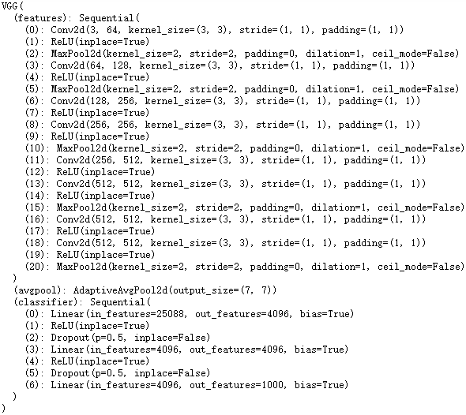
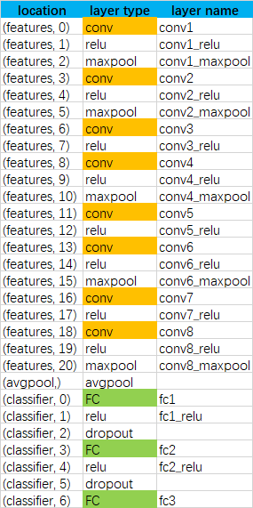

Layer to Module
===============

DNNBrain allows users to conveniently approach to the module inside a
built-in DNN by a commonly used layer name. For each built-in DNN, its
available layer names and the mapping between layer names and modules
are shown as follow. And we take the AlexNet as example to interpret
mechanism of the mapping.

AlexNet
-------

Generally, we can approach to a module by its location in the DNN
framework. For example, according to AlexNet framework (Fig. 1, left),
we can locate the first convolutional layer by its location (features,
0). However, DNNBrain users can easily do it by the layer name ‘conv1’
according to the mapping (Fig. 1, right).

.. raw:: html

   

   
|AlexNet_framework|
|AlexNet_mapping|

Figure 1

.. raw:: html

   

VggFace
-------

.. raw:: html

   

|VggFace_framework|
|VggFace_mapping|

Figure 2

.. raw:: html

   

Vgg11
-----

.. raw:: html

   

|Vgg11_framework|
|Vgg11_mapping|

Figure 3

.. raw:: html

   

