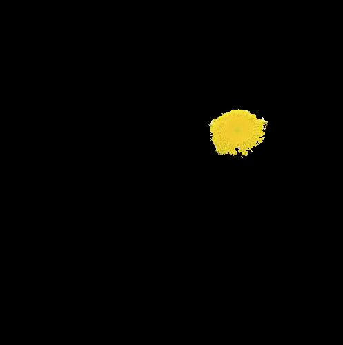

#Minimal Image There is an example of getting minimal images through
using python library of DNNBrain.

The original image used in this doc is displayed as below:

.. raw:: html

   

|original|

.. raw:: html

   

Example
-------

::

   import numpy as np
   import matplotlib.pyplot as plt

   from dnnbrain.dnn.base import ip
   from dnnbrain.dnn.models import AlexNet
   from dnnbrain.dnn.algo import MinimalParcelImage

   # Prepare DNN and image
   dnn = AlexNet()
   image = plt.imread('ILSVRC_val_00095233.JPEG')

   # Generate minimal image using felzenszwalb method
   # which cause almost equivalent activation as  
   # the raw stimlus' activation of the 122th unit of conv5.
   img_min = MinimalParcelImage(dnn, 'conv5', 122)
   img_min.felzenszwalb_decompose(image) 
   img_out = img_min.generate_minimal_image()

   # transform to PIL image and save out
   img_out = ip.to_pil(img_out.transpose(2,0,1), True)
   img_out.save('ILSVRC_val_00095233.JPEG_min.JPEG')

The minimal image is displayed as below:

.. raw:: html

   

|minimal|

.. raw:: html

   

.. |original| image:: ../img/ILSVRC_val_00095233.JPEG

