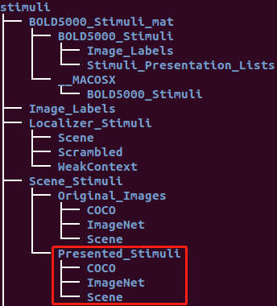

Tutorials
=========

We use the AlexNet model and BOLD5000 dataset to demonstrate the versatility and usability of DNNBrain in characterizing the DNN and in
examining the correspondences between the DNN and the brain. The results are also used in our `bioRxiv article <https://www.biorxiv.org/content/10.1101/2020.07.05.188847v1>`__, and more description about the model and dataset can be found at the 'Methods' part of this article.

The stimulus images are available by click `here <https://www.dropbox.com/s/5ie18t4rjjvsl47/BOLD5000_Stimuli.zip?dl=1>`__, and only the Presented_Stimuli (Fig. 1) will be used in the following tutorials. And a :doc:`.stim.csv <../docs/file_format>` file named as `all_5000scenes.stim.csv <TBD>`__ is used to tell DNNBrain where and what the inputs are. **We assume that the path to the "Presented_Stimuli" directory is** *path_to_presented_stimuli*. The first ten lines of *all_5000scenes.stim.csv* are shown as below:

::
   
   type=image
   path=path_to_presented_stimuli
   data=stimID,label
   COCO/COCO_train2014_000000023253.jpg,0
   COCO/COCO_train2014_000000429818.jpg,1
   COCO/COCO_train2014_000000226527.jpg,0
   COCO/COCO_train2014_000000201758.jpg,0
   COCO/COCO_train2014_000000430523.jpg,0
   ImageNet/n03777568_7670.JPEG,1
   ImageNet/n02090721_284.JPEG,0

.. raw:: html

   

Figure 1

.. raw:: html

   

The BOLD response maps for each image, should be firstly estimated from the preprocessed individual fMRI data through HCP pipelines. Then, the response maps of each image are finally averaged across four subjects in the fsLR space and used for mapping representations between DNN and brain. As a result, the data can't be acquired from BOLD5000 official website directly. If you need the data, feel free to contact us through the email (sunshine_drizzle@foxmail.com).

- In :doc:`Scan DNN <scan_DNN>` tutorial, we extract and display feature maps of three images for each convolutional layer after ReLU.

- In :doc:`Probe DNN <probe_DNN>` tutorial, we reveal animate information presented in DNN layers.

- In :doc:`Map between DNN and brain <map_between_DNN_and_brain>` tutorial, we examine how well the representation from each layer predict the response of a voxel in the brain by using voxel-wise encoding models. In addition, we also use representational similarity analysis to characterize the link between the representations of DNN and brain.

- In :doc:`Visualize DNN <visualize_DNN>` tutorial, We use three visualization ways to examine the stimulus features that an artificial neuron prefers.
