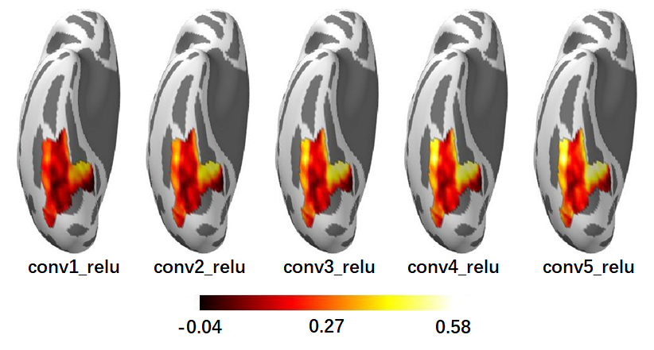
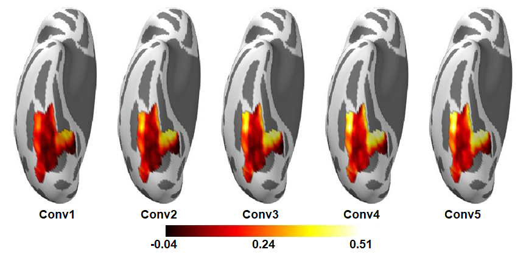

Map between DNN and brain
=========================
In this tutorial, we examine how well the representation from each layer predict the response of a voxel in the human ventral temporal cortex (VTC) by using both univariate and multivariate encoding models (EM). In addition, we also use representational similarity analysis (RSA) to characterize the link between the representations of DNN and brain.

First of all, use :doc:`dnn_act <../docs/cmd/dnn_act>` to extract representations of these images in layers we are interested in.

::

   dnn_act -net AlexNet -layer conv1_relu conv2_relu conv3_relu conv4_relu conv5_relu -stim all_5000scenes.stim.csv -out AlexNet_relu.act.h5 -cuda

To satisfy prerequisites of `Univariate encoding <#univariate-encoding>`__ and `Representational similarity analysis <#representational-similarity-analysis>`__, do Z-score standardization to ignore the magnitude of each image's representation:

::

    from scipy.stats import zscore
    from dnnbrain.dnn.core import Activation

    activ_file = 'AlexNet_relu.act.h5'
    out_file = 'AlexNet_relu_zscore.act.h5'

    activ = Activation()
    activ.load(activ_file)
    for layer in activ.layers:
        activ_arr = activ.get(layer)
        shape = activ_arr.shape
        activ_arr = activ_arr.reshape((shape[0], -1))
        activ_arr = zscore(activ_arr, axis=1)
        activ.set(layer, activ_arr.reshape(shape))
    activ.save(out_file)
	

Univariate encoding
-------------------
We train generalized linear models to map representations of each layer to each voxel within right VTC. The encoding scores is evaluated by pearson correlation between the measured responses and the predicted responses using a 10-fold cross validation procedure.

At each run of the cross validation before the generalized linear model, a PCA transformer will be fitted on the DNN representations splitted as training set, and then transform DNN representations both in training and testing set to keep the top 100 components.

::

    import os
    import numpy as np
    from os.path import join as pjoin
    from sklearn.decomposition import PCA
    from sklearn.linear_model import LinearRegression
    from sklearn.pipeline import make_pipeline
    from dnnbrain.dnn.core import Activation
    from dnnbrain.brain.core import BrainEncoder
    from dnnbrain.brain.io import load_brainimg, save_brainimg

    # load DNN activation
    dnn_activ = Activation()
    dnn_activ.load('AlexNet_relu_zscore.act.h5')

    # get brain activation within a mask
    brain_activ, header = load_brainimg('beta_rh_all_run.nii.gz')
    bshape = brain_activ.shape[1:]  # reserve the brain volume shape for recovery
    bmask, _ = load_brainimg('VTC_mask_rh.nii.gz', ismask=True)
    bmask = bmask.astype(np.bool)
    brain_activ = brain_activ[:, bmask]

    # build pipeline with PCA and LinearRegression
    pipe = make_pipeline(PCA(100), LinearRegression())

    # initialize encode method with brain activation
    # mv: multivariate mapping
    # 10-fold cross validation
    encoder = BrainEncoder(brain_activ, 'mv', pipe, 10, 'correlation')

    # encode DNN activation layer-wisely
    encode_dict = encoder.encode_dnn(dnn_activ)

    # save out
    out_dir = 'AlexNet_relu_zscore_PCA-100_glm_VTC-rh_cv-10_correlation'
    for layer, data in encode_dict.items():
        # prepare directory
        trg_dir = pjoin(out_dir, layer)
        if not os.path.isdir(trg_dir):
            os.makedirs(trg_dir)

        # save files while keeping brain volume's shape
        bshape_pos = list(range(1, len(bshape) + 1))
        for k, v in data.items():
            if k == 'model':
                arr = np.zeros((v.shape[0], *bshape), dtype=np.object)
                arr[:, bmask] = v
                arr = arr.transpose((*bshape_pos, 0))
                np.save(pjoin(trg_dir, k), arr)
            elif k == 'score':
                # save all cross validation scores
                arr = np.zeros((v.shape[0], *bshape, v.shape[-1]))
                arr[:, bmask, :] = v
                arr = arr.transpose((*bshape_pos, 0, -1))
                np.save(pjoin(trg_dir, k), arr)

                # save mean scores across cross validation folds
                img = np.zeros((v.shape[0], *bshape))
                img[:, bmask] = np.mean(v, 2)
                save_brainimg(pjoin(trg_dir, f'{k}.nii.gz'), img, header)

The encoding score maps of each layer are shown as Figure 1. The overall encoding score of the VTC gradually increased for the hierarchical layers of AlexNet, indicating that as the complexity of the visual representations increase along the DNN hierarchy, the representations become increasingly VTC-like.

.. raw:: html

   

Figure 1.

.. raw:: html

   

Multivariate encoding
---------------------
We build a PLS model to map representations of each layer to the whole right VTC. The encoding scores is evaluated by pearson correlation between the measured responses and the predicted responses using a 10-fold cross validation procedure.

::

    import os
    import numpy as np
    from os.path import join as pjoin
    from sklearn.cross_decomposition import PLSRegression
    from dnnbrain.dnn.core import Activation
    from dnnbrain.brain.core import BrainEncoder
    from dnnbrain.brain.io import load_brainimg, save_brainimg

    # load DNN activation
    dnn_activ = Activation()
    dnn_activ.load('AlexNet_relu.act.h5')

    # get brain activation within a mask
    brain_activ, header = load_brainimg('beta_rh_all_run.nii.gz')
    bshape = brain_activ.shape[1:]  # reserve the brain volume shape for recovery
    bmask, _ = load_brainimg('VTC_mask_rh.nii.gz', ismask=True)
    bmask = bmask.astype(np.bool)
    brain_activ = brain_activ[:, bmask]

    # initialize encode method with brain activation
    # mv: multivariate mapping
    # use PLS regression with 10 components
    # 10-fold cross validation
    encoder = BrainEncoder(brain_activ, 'mv', PLSRegression(10), 10, 'correlation')

    # encode DNN activation layer-wisely
    encode_dict = encoder.encode_dnn(dnn_activ)

    # save out
    out_dir = 'AlexNet_relu_pls-10_VTC-rh_cv-10_correlation'
    for layer, data in encode_dict.items():
        # prepare directory
        trg_dir = pjoin(out_dir, layer)
        if not os.path.isdir(trg_dir):
            os.makedirs(trg_dir)

        # save files while keeping brain volume's shape
        bshape_pos = list(range(1, len(bshape) + 1))
        for k, v in data.items():
            if k == 'model':
                arr = np.zeros((v.shape[0], *bshape), dtype=np.object)
                arr[:, bmask] = v
                arr = arr.transpose((*bshape_pos, 0))
                np.save(pjoin(trg_dir, k), arr)
            elif k == 'score':
                # save all cross validation scores
                arr = np.zeros((v.shape[0], *bshape, v.shape[-1]))
                arr[:, bmask, :] = v
                arr = arr.transpose((*bshape_pos, 0, -1))
                np.save(pjoin(trg_dir, k), arr)

                # save mean scores across cross validation folds
                img = np.zeros((v.shape[0], *bshape))
                img[:, bmask] = np.mean(v, 2)
                save_brainimg(pjoin(trg_dir, f'{k}.nii.gz'), img, header)

The encoding score maps of each layer are shown as Figure 2. The results are similar as the univariate encoding model, indicating that interactions between different voxels encode little representation information from each DNN Conv layer.

.. raw:: html

   

Figure 2.

.. raw:: html

   

Representational similarity analysis
------------------------------------
Instead of predicting brain responses directly, RSA compares the representations of the DNN and that of the brain using a representational dissimilarity matrix (RDM) as a bridge.

First of all, in order to reduce the computation load, the dimension (i.e. the number of units) of the representations from each layer reduced by PCA to retain the top 100 components:

::

    dnn_fe -act AlexNet_relu_zscore.act.h5 -meth pca 100 -out AlexNet_relu_zscore_PCA-100.act.h5

Then, RDMs are created to measure how similar the response patterns are for every pair of stimuli using the multivariate response patterns from the DNN and the brain, respectively.

::

    dnn_rsa -act AlexNet_relu_zscore_PCA-100.act.h5 -metric correlation -out AlexNet_relu_zscore_PCA-100.rdm.h5
    brain_rsa -nif beta_rh_all_run.nii.gz -bmask VTC_mask_rh.nii.gz -metric correlation -out beta_rh_VTC.rdm.h5

The RDMs are displayed in Figure 3 (rearranged by category information).

::

    import numpy as np
    from dnnbrain.dnn.core import RDM, Stimulus
    from dnnbrain.utils.plot import imgarray_show

    # load RDMs
    brdm = RDM()
    brdm.load('beta_rh_VTC.rdm.h5')
    drdm = RDM()
    drdm.load('AlexNet_relu_zscore_PCA-100.rdm.h5')

    # get rearrange indices
    stim = Stimulus()
    stim.load('all_5000scenes.stim.csv')
    labels = stim.get('label')
    labels_uniq = np.unique(labels)
    indices = []
    for lbl in labels_uniq:
        indices.extend(np.where(labels == lbl)[0])

    # get brain RDM
    brdm_arr = brdm.get('1', False)
    brdm_arr = brdm_arr + brdm_arr.T
    rdm_arrs = [brdm_arr[indices][:, indices]]
    img_names = ['VTC']

    # get DNN RDMs
    layers = [f'conv{i}_relu' for i in range(1, 6)]
    img_names.extend(layers)
    for layer in layers:
        drdm_arr = drdm.get(layer, False)[0]
        drdm_arr = drdm_arr + drdm_arr.T
        rdm_arrs.append(drdm_arr[indices][:, indices])

    # plot
    imgarray_show(rdm_arrs, 2, 3, cmap='hot', cbar=True,
                  frame_on=False, img_names=img_names)
	

.. raw:: html

   

.. image:: ../img/tutorial/RSA.png
Figure 3.

.. raw:: html

   

Finally, the representation similarity between the DNN and the brain is further calculated as the correlation between their RDMs.

::

    from scipy.stats import pearsonr
    from dnnbrain.dnn.core import RDM

    # load RDMs
    brdm = RDM()
    brdm.load('beta_rh_VTC.rdm.h5')
    drdm = RDM()
    drdm.load('AlexNet_relu_zscore_PCA-100.rdm.h5')

    # calculate correlation between DNN RDMs and brain RDM.
    layers = [f'conv{i}_relu' for i in range(1, 6)]
    brdm_arr = brdm.get('1', True)
    for idx, layer in enumerate(layers):
        drdm_arr = drdm.get(layer, True)[0]
        corr = pearsonr(brdm_arr, drdm_arr)[0]
        print(f'VTC corr {layer}: {corr}')

::

    VTC corr conv1_relu: 0.03464011398198113
    VTC corr conv2_relu: 0.10030119703217032
    VTC corr conv3_relu: 0.12072425356261852
    VTC corr conv4_relu: 0.15505480200918992
    VTC corr conv5_relu: 0.16584085748763797
