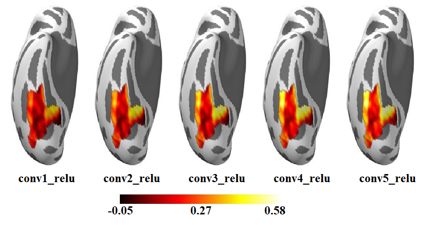
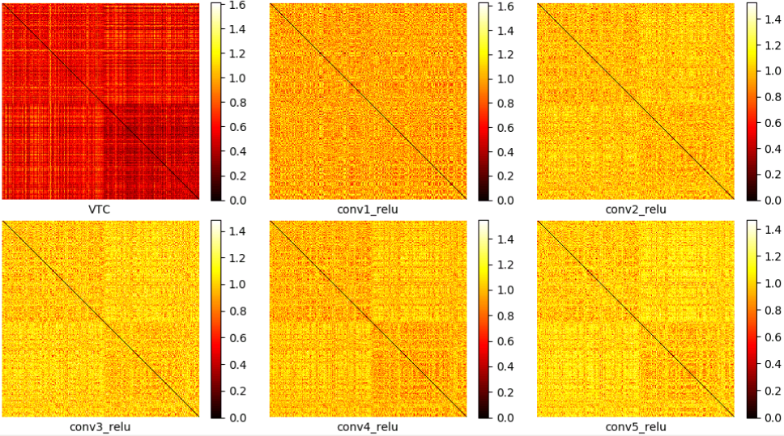

Map between DNN and brain
=========================
In this tutorial, we examine how well the representation from each layer predict the response of a voxel in the human ventral temporal cortex (VTC)  by using voxel-wise encoding models (EM). In addition, we also use representational similarity analysis (RSA) to characterize the link between the representations of DNN and brain.

Firstly, use :doc:`dnn_act <../docs/cmd/dnn_act>` to extract representations of these images in layers we are interested in.

::

   dnn_act -net AlexNet -layer conv1_relu conv2_relu conv3_relu conv4_relu conv5_relu -stim all_5000scenes.stim.csv -out AlexNet_relu.act.h5 -cuda

Secondly, do Z-score standardization to ignore the magnitude of each image's representation:

::

    from scipy.stats import zscore
    from dnnbrain.dnn.core import Activation

    activ_file = 'AlexNet_relu.act.h5'
    out_file = 'AlexNet_relu_zscore.act.h5'

    activ = Activation()
    activ.load(activ_file)
    for layer in activ.layers:
        activ_arr = activ.get(layer)
        shape = activ_arr.shape
        activ_arr = activ_arr.reshape((shape[0], -1))
        activ_arr = zscore(activ_arr, axis=1)
        activ.set(layer, activ_arr.reshape(shape))
    activ.save(out_file)

Thirdly, reduce the dimension (i.e. the number of units) of the representations from each layer by PCA to retain the top 100 components:

::

    dnn_fe -act AlexNet_relu_zscore.act.h5 -meth pca 100 -out AlexNet_relu_zscore_PCA-100.act.h5

Voxel-wise encoding
-------------------
We train generalized linear models to map representation of each layer to each voxel within right VTC. The encoding accuracy is evaluated with the Pearson correlation between the measured responses and the predicted responses using a 10-fold cross validation procedure.

::

   db_encode -anal mv -act AlexNet_relu_zscore_PCA-100.act.h5 -resp beta_rh_all_run.nii.gz -bmask VTC_mask_rh.nii.gz -model glm -scoring correlation -cv 10 -out AlexNet_relu_zscore_PCA-100_glm-corr_cv-10_VVA_rh

The encoding accuracy maps of each layer are shown as Figure 1. The overall encoding accuracy of the VTC gradually increased for the hierarchical layers of AlexNet, indicating that as the complexity of the visual representations increase along the DNN hierarchy, the representations become increasingly VTC-like.

.. raw:: html

   

Figure 1.

.. raw:: html

   

Representational similarity analysis
------------------------------------
Instead of predicting brain responses directly, RSA compares the representations of the DNN and that of the brain using a representational dissimilarity matrix (RDM) as a bridge.

The RDMs are first created to measure how similar the response patterns are for every pair of stimuli using the multivariate response patterns from the DNN and the brain, respectively.

::

    dnn_rsa -act AlexNet_relu_zscore_PCA-100.act.h5 -metric correlation -out AlexNet_relu_zscore_PCA-100.rdm.h5
    brain_rsa -nif beta_rh_all_run.nii.gz -bmask VTC_mask_rh.nii.gz -metric correlation -out beta_rh_VTC.rdm.h5

The RDMs are displayed in Figure 2 (rearranged by category information).

::

    import numpy as np
    from dnnbrain.dnn.core import RDM, Stimulus
    from dnnbrain.utils.plot import imgarray_show

    # load RDMs
    brdm = RDM()
    brdm.load('beta_rh_VTC.rdm.h5')
    drdm = RDM()
    drdm.load('AlexNet_relu_zscore_PCA-100.rdm.h5')

    # get rearrange indices
    stim = Stimulus()
    stim.load('all_5000scenes.stim.csv')
    labels = stim.get('label')
    labels_uniq = np.unique(labels)
    indices = []
    for lbl in labels_uniq:
        indices.extend(np.where(labels == lbl)[0])

    # get brain RDM
    brdm_arr = brdm.get('1', False)
    brdm_arr = brdm_arr + brdm_arr.T
    rdm_arrs = [brdm_arr[indices][:, indices]]
    img_names = ['VTC']

    # get DNN RDMs
    layers = [f'conv{i}_relu' for i in range(1, 6)]
    img_names.extend(layers)
    for layer in layers:
        drdm_arr = drdm.get(layer, False)[0]
        drdm_arr = drdm_arr + drdm_arr.T
        rdm_arrs.append(drdm_arr[indices][:, indices])

    # plot
    imgarray_show(rdm_arrs, 2, 3, cmap='hot', cbar=True,
                  frame_on=False, img_names=img_names)
	

.. raw:: html

   

Figure 2.

.. raw:: html

   

Finally, the representation similarity between the DNN and the brain is further calculated as the correlation between their RDMs.

::

    from scipy.stats import pearsonr
    from dnnbrain.dnn.core import RDM

    # load RDMs
    brdm = RDM()
    brdm.load('beta_rh_VTC.rdm.h5')
    drdm = RDM()
    drdm.load('AlexNet_relu_zscore_PCA-100.rdm.h5')

    # calculate correlation between DNN RDMs and brain RDM.
    layers = [f'conv{i}_relu' for i in range(1, 6)]
    brdm_arr = brdm.get('1', True)
    for idx, layer in enumerate(layers):
        drdm_arr = drdm.get(layer, True)[0]
        corr = pearsonr(brdm_arr, drdm_arr)[0]
        print(f'VTC corr {layer}: {corr}')

::

    VTC corr conv1_relu: 0.03464011398198113
    VTC corr conv2_relu: 0.10030119703217032
    VTC corr conv3_relu: 0.12072425356261852
    VTC corr conv4_relu: 0.15505480200918992
    VTC corr conv5_relu: 0.16584085748763797
