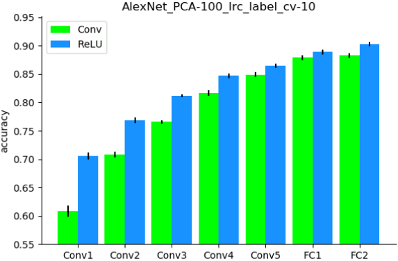

Probe DNN
=========
To reveal whether specific stimuli attributes or behavioral performances are explicitly encoded in a certain layer of a DNN, a direct approach is to measure to what degree is the representation from the layer useful for decoding them. Linear decoding models (classifier or regression) were implemented in DNNBrain to fulfill this.

In this tutorial, we manually sorted the BOLD5000 stimulus images into binary categories (animate versus inanimate) according to salient objects located in each image, and examined how animate information are explicitly encoded in AlexNet. In total, 2,547 images were labeled as animate, and 2,369 inanimate. The labels are available in the *all_5000scenes.stim.csv*.

Firstly, use :doc:`dnn_act <../docs/cmd/dnn_act>` to extract representations of these images in layers we are interested in.

::

   dnn_act -net AlexNet -layer conv1 conv2 conv3 conv4 conv5 fc1 fc2 -stim all_5000scenes.stim.csv -out AlexNet.act.h5 -cuda
   dnn_act -net AlexNet -layer conv1_relu conv2_relu conv3_relu conv4_relu conv5_relu fc1_relu fc2_relu -stim all_5000scenes.stim.csv -out AlexNet_relu.act.h5 -cuda

To avoid the risk of overfitting with the limited training data, the dimension (i.e. the number of units) of the representations from each layer is reduced by PCA to retain the top 100 components.
Then, train a logistic regression model on the artificial representation from each layer to decode the stimulus category. The accuracy of the model is evaluated with a 10-fold cross validation.

::

    import os
    import numpy as np
    from os.path import join as pjoin
    from sklearn.pipeline import make_pipeline
    from sklearn.decomposition import PCA
    from sklearn.linear_model import LogisticRegression
    from dnnbrain.dnn.core import DnnProbe, Activation, Stimulus
    
    
    def probe(fname):
        
        # load DNN activation
        activ = Activation()
        activ.load(fname)
        
        # load labels
        stim = Stimulus()
        stim.load('all_5000scenes.stim.csv')
        labels = stim.get('label')[:, None]
        
        # build pipeline with PCA and LogisticRegression
        pipe = make_pipeline(PCA(100), LogisticRegression())
        
        # initialize probe method with DNN activation
        # mv: multivariate mapping
        # 10-fold cross validation
        probe = DnnProbe(activ, 'mv', pipe, 10)
        
        # probe label layer-wisely
        probe_dict = probe.probe(labels)
        
        # save out
        out_dir = 'AlexNet_PCA-100_lrc_label_cv-10'
        for layer, data in probe_dict.items():
            # prepare directory
            trg_dir = pjoin(out_dir, layer)
            if not os.path.isdir(trg_dir):
                os.makedirs(trg_dir)
            
            # saving
            for k, v in data.items():
                np.save(pjoin(trg_dir, k), v)
    
    probe('AlexNet.act.h5')
    probe('AlexNet_relu.act.h5')
    

Finally, we summarize and plot the results:

::

    import numpy as np
    from os.path import join as pjoin
    from scipy.stats import sem
    from matplotlib import pyplot as plt
    
    data_dir = 'AlexNet_PCA-100_lrc_label_cv-10'
    
    # prepare layer names
    layer_groups = [
        ['conv1', 'conv2', 'conv3', 'conv4', 'conv5', 'fc1', 'fc2'],
        ['conv1_relu', 'conv2_relu', 'conv3_relu', 'conv4_relu', 'conv5_relu', 'fc1_relu', 'fc2_relu']]
    n_row = len(layer_groups)
    n_col = len(layer_groups[0])
    
    # calculate mean and SEM
    ys = np.zeros((n_row, n_col))
    ys_err = np.zeros((n_row, n_col))
    for row_idx, layers in enumerate(layer_groups):
        for col_idx, layer in enumerate(layers):
            scores = np.load(pjoin(data_dir, layer, 'score.npy')).squeeze()
            ys[row_idx, col_idx] = np.mean(scores)
            ys_err[row_idx, col_idx] = sem(scores)
    
    # plot
    plt.figure(figsize=(6, 4))
    x = np.arange(n_col)
    width = 0.43
    plt.bar(x - width/2, ys[0], width, yerr=ys_err[0], color='lime', label='Conv')
    plt.bar(x + width/2, ys[1], width, yerr=ys_err[1], color='dodgerblue', label='ReLU')
    plt.ylim(0.55)
    plt.gca().spines['top'].set_visible(False)
    plt.gca().spines['right'].set_visible(False)
    plt.title(data_dir)
    plt.xticks(x, ['Conv1', 'Conv2', 'Conv3', 'Conv4', 'Conv5', 'FC1', 'FC2'])
    plt.ylabel('accuracy')
    plt.legend()
    plt.tight_layout()
    plt.show()
    

As shown in Figure 1, the classification accuracy progressed with the depth of Conv layers, indicating higher layers encode more animate information than lower layers. Moreover, the ReLU operation within each convolutional layer plays a significant role in improving the representation capacities for animate information.

.. raw:: html

   

Figure 1.

.. raw:: html

   
