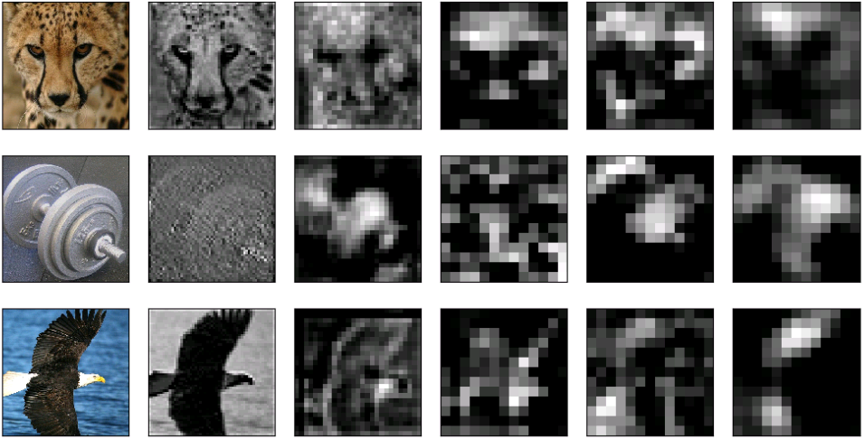

Scan DNN
========
In this tutorial, we are going to extract and display feature maps of three example images (cheetah, dumbbell, and bald eagle) for each convolutional layer after ReLU (Conv layer).

Firstly, we should prepare a :doc:`.stim.csv <../docs/file_format>` file, which can tell DNNBrain where and what the inputs are. We assume that the file name is *examples.stim.csv*, and its content is shown as below:

::

   type=image
   path=path_to_presented_stimuli/ImageNet
   data=stimID
   n02130308_9559.JPEG
   n03255030_4054.JPEG
   n01614925_407.JPEG

Then, we can use a command-line interface (CLI) :doc:`dnn_act <../docs/cmd/dnn_act>` to extract feature maps:

::

   dnn_act -net AlexNet -layer conv1_relu conv2_relu conv3_relu conv4_relu conv5_relu -stim examples.stim.csv -cuda -out AlexNet_relu.act.h5

Finally, we select the channels, which show the maximal mean activation within each of the five Conv layers, for each image. And feature maps of these channels as well as the original images are displayed (Fig. 1).

::

   import numpy as np

   from os.path import join as pjoin
   from matplotlib import pyplot as plt
   from dnnbrain.dnn.core import Activation, Stimulus
   from dnnbrain.utils.plot import imgarray_show
   
   # initialize an array to save maximal channel indices
   n_img = 3  # the number of example images
   n_layer = 5  # the number of Conv layers
   max_chn_indices = np.zeros((n_img, n_layer), np.int)
   
   # load feature maps
   activ = Activation()
   activ.load('AlexNet_relu.act.h5')
   
   # find maximal channel indices for each layer
   activ_pool = activ.pool('mean')  # calculate mean value of each channel
   for idx, layer in enumerate(activ_pool.layers):
       data = activ_pool.get(layer).squeeze()
       max_chn_indices[:, idx] = np.argmax(data, 1)
   print('maximal channel indices:\n', max_chn_indices)
   
   # load stimulus information
   stim = Stimulus()
   stim.load('examples.stim.csv')

   # plot original images and feature maps
   img_arrs = []
   for idx, row in enumerate(max_chn_indices):
       ori_file = pjoin(stim.header['path'], stim.get('stimID')[idx])  # get path of the original file
       img_arrs.append(plt.imread(ori_file))
       for lyr_idx, max_chn_idx in enumerate(row):
           layer = activ.layers[lyr_idx]
           img_arrs.append(activ.get(layer)[idx, max_chn_idx])
   imgarray_show(img_arrs, nrows=n_img, ncols=n_layer+1, cmap='gray')
   

::

   maximal channel indices:
    [[ 52 154 216  56  77]
    [  8 129 233  19  26]
    [ 40 134  30 254 133]]

.. raw:: html

   

Figure 1. The leftmost column shows the three example images. Columns on the right show the feature maps from the channels with the maximal mean activation within each of five Conv layers (from Conv1 to Conv5 in turn).

.. raw:: html

   

