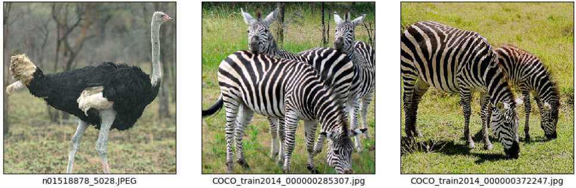
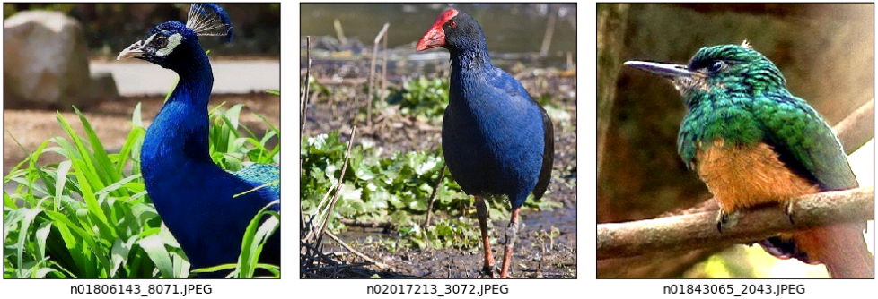
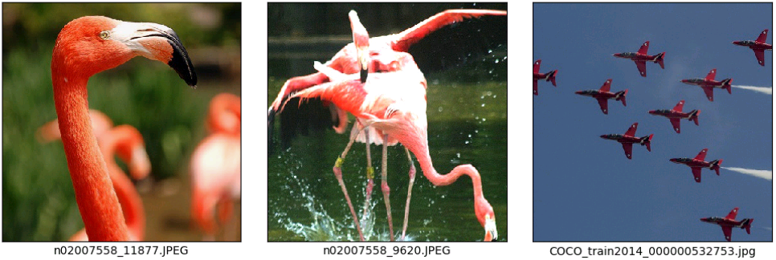
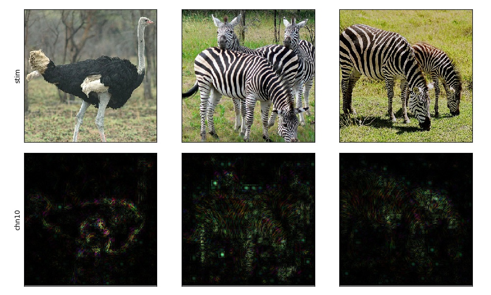
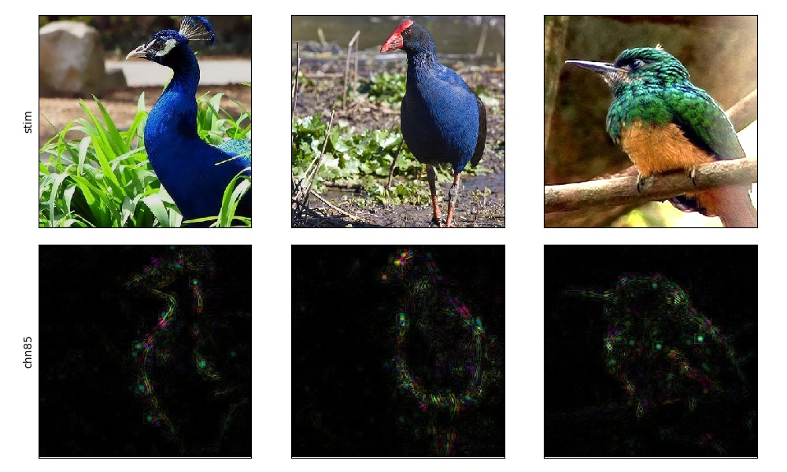
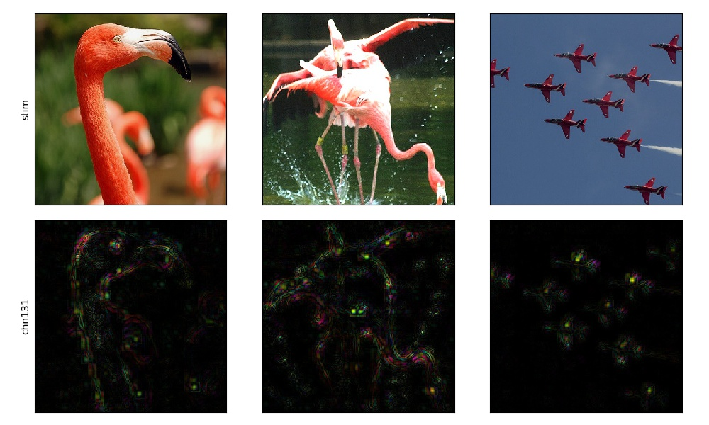
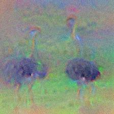
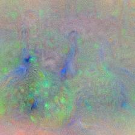
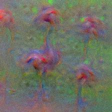

Visualize DNN
=============
In this tutorial, we are going to visualize the preferred features for three output units of AlexNet (i.e., ostrich, peacock, and flamingo). And three visualization approaches will be demonstrated (i.e., top stimulus, saliency map, and optimal stimulus).

Top stimulus
------------
We can find top3 images with the highest activation for a specific unit from a large image collection.

::

    dnn_topstim -net AlexNet -top 3 -stim all_5000scenes.stim.csv -layer fc3 -chn 10 85 131 -cuda -out .

For each unit, it will generate a stimulus file which contains information of the top3 images. Each file's content and corresponding images are listed as below. The value column saves activation values for each top image.

**fc3_chn10_top3.stim.csv:** ostrich

::

    type=image
    path=path_to_presented_stimuli
    data=stimID,label,value
    ImageNet/n01518878_5028.JPEG,0,25.264225
    COCO/COCO_train2014_000000285307.jpg,0,21.425774
    COCO/COCO_train2014_000000372247.jpg,0,19.897854

.. raw:: html

   

.. raw:: html

   

**fc3_chn85_top3.stim.csv:** peacock

::

    type=image
    path=path_to_presented_stimuli
    data=stimID,label,value
    ImageNet/n01806143_8071.JPEG,0,26.520958
    ImageNet/n02017213_3072.JPEG,0,23.622944
    ImageNet/n01843065_2043.JPEG,0,23.04847

.. raw:: html

   

.. raw:: html

   

**fc3_chn131_top3.stim.csv:**  flamingo

::

    type=image
    path=path_to_presented_stimuli
    data=stimID,label,value
    ImageNet/n02007558_11877.JPEG,0,23.366217
    ImageNet/n02007558_9620.JPEG,0,21.880175
    COCO/COCO_train2014_000000532753.jpg,1,18.621128

.. raw:: html

   

.. raw:: html

   

Saliency map
------------
Saliency map is acquired by computing gradients on the input images relative to the target unit by a backpropagation algorithm. It highlights pixels of the image that increase the unit’s activation most when its value changes. Here, we show saliency maps of the top3 images for each three units.

::

    dnn_saliency -net AlexNet -layer fc3 -chn 10 -stim fc3_chn10_top3.stim.csv -meth guided -mode RGB -out .

.. raw:: html

   

.. raw:: html

   

::

    dnn_saliency -net AlexNet -layer fc3 -chn 85 -stim fc3_chn85_top3.stim.csv -meth guided -mode RGB -out .

.. raw:: html

   

.. raw:: html

   

::

    dnn_saliency -net AlexNet -layer fc3 -chn 131 -stim fc3_chn131_top3.stim.csv -meth guided -mode RGB -out .

.. raw:: html

   

.. raw:: html

   

Optimal stimulus
----------------
The optimal stimulus is synthesized from scratch guided by increasing activation of the target unit. It offers advantages over the top stimulus and saliency map because it avoids the risks that effective images that could activate the target unit may not exist in the stimulus set.

We get optimal stimulus for each three units using the following codes and show the results at below.

::

    from dnnbrain.dnn.models import AlexNet
    from dnnbrain.dnn.algo import SynthesisImage
    from dnnbrain.dnn.base import ip
    
    dnn = AlexNet()
    synthesis = SynthesisImage(dnn)
    
    # synthesize ostrich stimulus
    synthesis.set_layer('fc3', 10)
    synthesis.set_loss('mean', 'TV', 0.1)
    img_out = synthesis.synthesize(lr=1.0, n_iter=500)
    img_out = ip.to_pil(img_out, True)
    img_out.save('synthesized_ostrich.jpg')
    
    # synthesize peacock stimulus
    synthesis.set_layer('fc3', 85)
    synthesis.set_loss('mean', 'TV', 0.05)
    img_out = synthesis.synthesize(lr=2.5, n_iter=500)
    img_out = ip.to_pil(img_out, True)
    img_out.save('synthesized_peacock.jpg')
    
    # synthesize flamingo stimulus
    synthesis.set_layer('fc3', 131)
    synthesis.set_loss('mean', 'TV', 0.1)
    img_out = synthesis.synthesize(lr=1.0, n_iter=500)
    img_out = ip.to_pil(img_out, True)
    img_out.save('synthesized_flamingo.jpg')

+---------------------+---------------------+----------------------+
||synthesized_ostrich|||synthesized_peacock|||synthesized_flamingo||
+---------------------+---------------------+----------------------+
| synthesized_ostrich | synthesized_peacock | synthesized_flamingo |
+---------------------+---------------------+----------------------+

