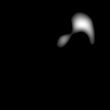

# Name
dnn_rf_us - Visualize receptive field using up-sampling(us) method for interested channels

# Synopsis
dnn_rf_us -net Net -layer Layer -chn Channel -stim Stimulus -ip_metric InterpolateMetric -up_thres Threshold -out Output

# Arguments
## Required Arguments
|Argument|Discription|
|--------|-----------|
|net     |Name of a neural network|
|stim    |Path of a .stim.csv file which contains stimulus information|
|layer   |Name of the target layer.</br>Only support one layer each time.</br>E.g., 'conv1' represents the first convolution layer, and 'fc1' represents the first full connection layer.|
|chn     |Index of target channel.</br>Only support one channel each time.</br>Channel index starts from 1.|
|ip_metric     |Interpolate method for magnifying the feature map.</br>Only support nearest/linear/bilinear/bicubic/trilinear/bicubic.|
|up_thres    |Threshold for activation.</br>The threshold(float) is in the range of 0-1.|
|out     |Output path to save the upsampling image|

# Outputs
A series of upsampling images based on your stimilus and interested net information

# Examples
```
dnn_rf_us -net AlexNet -layer conv5 -chn 122 -stim ./flowers.stim.csv -ip_metric bicubic -up_thres 0.95 -out ./image/rf_us/
```
The original image used in this doc is displayed as below:
<center></center>

The receptive field upsampling is displayed as below:
<center></center>