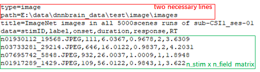
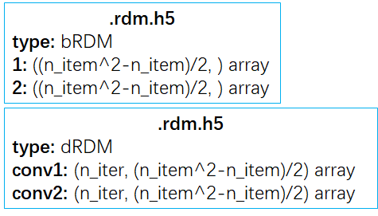

# File Format
As a software toolbox, DNNBrain have to load source data from and save result data to files inevitably. In order to regularize the data storage of DNNBrain on the hard disk, we design some file formats including .stim.csv, .dmask.csv, .act.h5, .roi.h5, and .rdm.h5.

You can check the summary information of these files by using db_info. Such as:
```
db_info AlexNet.act.h5
```

## .stim.csv
First and foremost, we have to input stimulus data before getting either DNN activation or brain response. And we design a file format which is recognized by the **dual suffix “.stim.csv”** to help DNNBrain load stimuli of interest from the specified place on the hard disk. More than that, the .stim.csv file is designed to contain other stimulus information and even behavior data. More details will be stated below (Fig. 1).  
<center>  
Fig. 1</center>  
The .stim.csv file is a type of text file adapted from the CSV (comma separated values) file format. **Its contents are divided into two parts by the line that starts with “data=”.** The lines before the “data=” line are **header** portion, and the remaining lines are **data** portion.  

The header contains metainformation about the data, and each line in header is a key/value pair separated by equal sign “=”: the left is the key and the right is the value. **Two necessary lines** should be included in the header. One is the “type=” line, its value must be image or video which indicates the type of stimulus data. The other is the “path=” line, its value is the parent directory of image stimuli (type=image) or the file path of video stimuli (type=video). Other key/value pairs are optional and defined by users at will.  

**The data begins with “data=” line, its value contains some fields separated by comma “,”. Under the “data=” line, data are organized as a n_stim x n_field matrix (n_stim: the number of stimuli; n_field: the number of fields in the “data=” line).** The rows of the matrix are the lines under the “data=” line, and the columns separated by comma “,” are one-to-one corresponding with fields. There should be at least one field named “stimID”. If the type is image, the elements of “stimID” column are paths of image files relative to the parent directory in “path=” line; If the type is video, the elements of “stimID” column are serial numbers of frames of the video file in “path=” line. Other fields are optional and defined by users at will, for example, users can add some behavior fields such as “reaction time” and “response”. It should be noted that some field names (“label”, “condition”, “onset” and “duration”) are reserved words used by DNNBrain. “label” means category label of a stimulus. “condition” means category name. “onset” is the onset time of a stimulus relative to the start of brain activity. “duration” is the duration time after an onset. Other self-defined fields’ values in corresponding columns will be regarded as float type.

## .dmask.csv
We design “.dmask.csv” file format to conveniently define layers / channels / rows / columns of interest as a mask of DNN units. It is also a text file adapted from CSV file format(Fig. 2).  
<center>  
Fig. 2</center>  
The number of layers in the file is counted by layer lines that contain an equal sign “=”. The left of the “=” is layer name, and the right are axes separated by comma “,” and chose from “chn”, “row” and “col” (chn: channel; col: column). Under a layer line, there are n_axis lines which are ono-to-one corresponding with axes, and each line contains serial numbers of interest of the corresponding axis which are separated by comma “,”.

## .act.h5
For storage of DNN activation produced or used by DNNBrain, we design the “.act.h5” file format. It is actually a HDF5 (Hierarchical Data Format 5) file. The .act.h5 file is able to store different layers’ activation, and each layer’s activation can be retrieved by its own layer name. The activation data of each layer are organized as a n_stim x n_chn x n_row x n_col array, as a result, the activation of the fully connected layer should be organized as a n_stim x n_feat x 1 x 1 array.

## .roi.h5
“.roi.h5” file format is designed to store ROI names and data of brain response. ROI names are organized as a list which can be retrieved by keyword “roi”, and ROI data are organized as a n_vol x n_roi array which can be retrieved by keyword “data”. There is one-to-one correspondence between ROI names and columns of the data array.

## .rdm.h5
".rdm.h5" file format is designed to store representation distance matrices (RDMs) for DNN activation and brain activation, and we use "dRDM" and "bRDM" to distinguish each other respectively. If the type of RDM is "dRDM", each layer's RDMs can be retrieved by its own layer name; If the type is "bRDM", each ROI's RDM can be retrieved by its own ROI label (Fig. 3).  
**Note: **For saving time and space, ".rdm.h5" file only hold on the upper triangle of each RDM. We can use np.tri(n_item, k=-1, dtype=np.bool).T to get the index array of the upper triangle. And the index array can help us to restore RDM from the upper triangle whose shape is ((n_item^2-n_item)/2,).
<center>  
Fig. 3</center>
