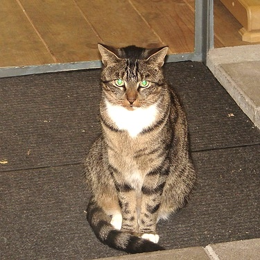
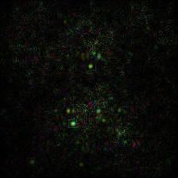
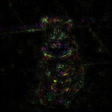

# Saliency Image
There are some examples of getting saliency images through using python library of DNNBrain.

The original image used in this doc is displayed as below:
<center></center>
## Example 1
Vanilla Saliency Image
```
import numpy as np

from PIL import Image
from dnnbrain.dnn.base import ip
from dnnbrain.dnn.models import AlexNet
from dnnbrain.dnn.algo import VanillaSaliencyImage

# Prepare DNN and image
dnn = AlexNet()
image = Image.open('n03223299_27176.JPEG')

# Get the vanilla saliency image of the image
# which displays the saliency parts that contribute to 
# the activation of the 540th unit of fc3.
vanilla = VanillaSaliencyImage(dnn)
vanilla.set_layer('fc3', 540)
img_out = np.abs(vanilla.backprop(image))

# transform to PIL image and save out
img_out = ip.to_pil(img_out, True)
img_out.save('n03223299_27176_vanilla_saliency.JPEG')
```
The vanilla saliency image is displayed as below:
<center></center>

## Example 2
Guided Saliency Image
```
import numpy as np

from PIL import Image
from dnnbrain.dnn.base import ip
from dnnbrain.dnn.models import AlexNet
from dnnbrain.dnn.algo import GuidedSaliencyImage

# Prepare DNN and image
dnn = AlexNet()
image = Image.open('n03223299_27176.JPEG')

# Get the guided saliency image of the image
# which displays the saliency parts that contribute to 
# the activation of the 540th unit of fc3.
guided = GuidedSaliencyImage(dnn)
guided.set_layer('fc3', 540)
img_out = np.abs(guided.backprop(image))

# transform to PIL image and save out
img_out = ip.to_pil(img_out, True)
img_out.save('n03223299_27176_guided_saliency.JPEG')
```
The guided saliency image is displayed as below:
<center></center>
