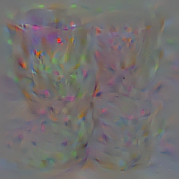
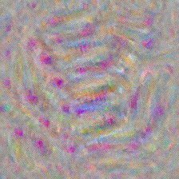
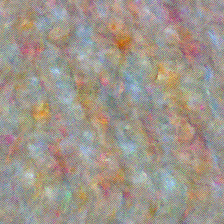
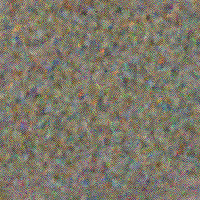
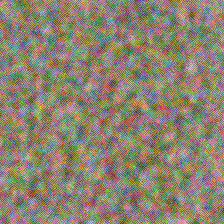
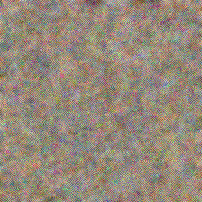

#Synthesize Optimal Image
There is an example to synthesize the image which can extract the highest activation of target unit.

## Code
```
#import 
import os
from os.path import join as pjoin
import numpy as np
from dnnbrain.dnn.models import AlexNet
from dnnbrain.dnn.algo import SynthesisImage
from dnnbrain.dnn.base import ip

#0: Folds preparation

path = pjoin(os.getcwd(),'SythesizeImages')
if not os.path.exists(path):
	os.makedirs(path)


#1:Parameter Set

#1.1 target channels

layer_chn = {'fc3':[969], #fc3 has 1000 units
 					#flower,ostrich,goose, flamingo,cup 
			'conv5':[256], # conv5 has 256 channels
			'conv4':[256], # conv4 has 256 channels
			'conv3':[384], # conv3 has 384 channels
			'conv2':[192], # conv2 has 192 channels
			'conv1':[96] # conv1 has 96 channels
			}

#1.2 method 
#1.2.1 Regularization
reg_meth = 'TV' # Method name:total variance
reg_lambda = 0.01 
#1.2.2 Image Precondition
pre_meth = 'GB' # Method name: guassian blur
GB_radius = 0.3
#1.2.3 Gradient Smooth
sm_meth = 'Fourier' #Method name: Fourier filter
factor = 0.3

#1.3 utiliz
#1.3.1 Save interval images when iterating
save_out_interval=True
save_interval = 10 # every 10 iteration save one
#1.3.2 Print when iterating
print_inter_loss=True
step = 10 # print loss every 10 iterations

#2: Synthesize
dnn = AlexNet()
lr = 0.1 #learning rate
n_iter = 150 # number of iterations
synthesis = SynthesisImage(dnn)
synthesis.set_metric(activ_metric='mean',regular_metric=reg_meth,
                   precondition_metric=pre_meth, smooth_metric=sm_meth)
synthesis.set_utiliz(save_out_interval,print_inter_loss)

#start sythesize
for layer, chn in layer_chns.items():
	for i in range(len(chn)):
		synthesis.set_layer(layer,chn[i])
		optimal_img = synthesis.synthesize(init_image=None,unit=None,lr=lr, 			
											regular_lambda = reg_lambda, n_iter = n_iter, save_path = path,
												save_interval = save_interval, GB_radius = GB_radius, factor = factor, step = step)
		
		# Save final images
		file_name = f'optimal_{layer}_chn{chn[i]}.png'
		file_path = pjoin(path,file_name)
		img_out = ip.to_pil(optimal_img,True)
		img_out.save(file_path)

```
The optimal image is displayed as below:
|layer|channel|optimal image|
|:------:|:------:|:------:|
|fc3|969||
|conv5|256||
|conv4|256||
|conv3|384||
|conv2|192||
|conv1|96||