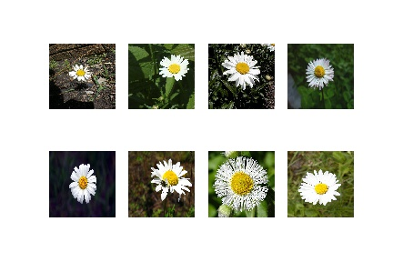
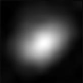

Empirical Receptive Field 
=========================

There is an example of visualizing a set of images' empirical receptive field 
using up-sampling(us) method through using python library of
DNNBrain.

The original images used in this doc are displayed as below:

.. raw:: html

   

|original|

.. raw:: html

   

Example
-------

::

   from dnnbrain.dnn.base import ip
   from dnnbrain.dnn.core import Stimulus
   from dnnbrain.dnn.models import AlexNet
   from dnnbrain.dnn.algo import EmpiricalReceptiveField, UpsamplingActivationMapping

   # Prepare DNN and stimulus
   dnn = AlexNet()
   stim = Stimulus()
   stim.load('test.stim.csv')

   # Visualizing empirical receptive field using up-sampling(us) engine
   # which displays the receptive field that contribute to 
   # the activation of the 122th unit of conv5.
   up_estimator =UpsamplingActivationMapping(dnn, 'conv5', 122)
   up_estimator.set_params(interp_meth='bicubic', interp_threshold=0.50)
   emp_rf = EmpiricalReceptiveField(up_estimator)
   img_out = emp_rf.compute(stim)

   # transform to PIL image and save out
   img_out = ip.to_pil(img_out, True)
   img_out.save('empirical_rf.JPEG')

The empirical receptive field image is displayed as below:

.. raw:: html

   

|emprical|

.. raw:: html

   

