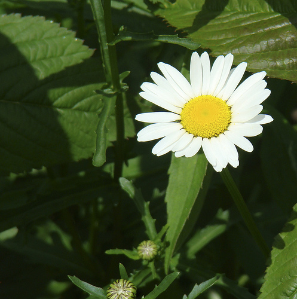
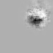

Occluder Map
=========================

Occluder map is a way to visualize which regions of the image lead to the high unit activations.

Before generating the occluder map, you need to ensure that the images can be highly activated by the given unit in DNN,
which can be obtained using `dnn_topstim <https://dnnbrain.readthedocs.io/en/latest/docs/cmd/dnn_topstim.html>`__
(Select the topK stimuli from a stimulus set).

Refer to the `passage by Zhou et al. <https://arxiv.org/abs/1412.6856>`__, the procedures are as follows. 
First, we use a small occulder with certain size(Eg. 11x11 pixels) and move it in a dense grid with 
certain stride for each image. When this occluder moving from top left to bottom right, it will generate 
thousands of images per original image. Then these "occluder images" are fed into the network and record their
activations. If the occluded patch is important, there will be a large discrepancy in the corresponding area.
Finally we average the output feature maps and get the discrepancy occluder map.

There is an example of slide-window (sw) occulding method 
through using python library of DNNBrain.

The original image used in this doc is displayed as below:

.. raw:: html

   

|original|

.. raw:: html

   

Example
-------

::

   import numpy as np
   import matplotlib.pyplot as plt

   from dnnbrain.dnn.base import ip
   from dnnbrain.dnn.models import AlexNet
   from dnnbrain.dnn.algo import OccluderDiscrepancyMapping

   # Prepare DNN and image
   dnn = AlexNet()
   image = plt.imread('ILSVRC_val_00095233.JPEG')

   # Using slide-window (sw) method to display 
   # regions of the image that contribute to 
   # the activation of the 122th unit of conv5.
   oc_estimator = OccluderDiscrepancyMapping(dnn, 'conv5', 122)
   oc_estimator.set_params(window=(11,11), stride=(2,2), metric='max')
   img_out = oc_estimator.compute(image)

   # transform to PIL image and save out
   img_out = ip.to_pil(img_out, True)
   img_out.save('ILSVRC_val_00095233_rf_sw.JPEG')

The receptive field occulding image is displayed as below:

.. raw:: html

   

|occluding|

.. raw:: html

   

