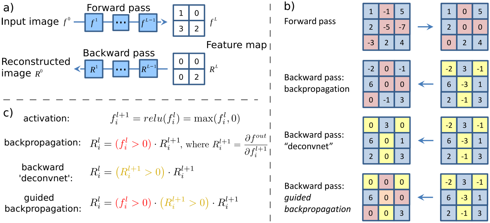

Saliency Image
==============

There are some examples of getting "Vanilla" and "Guided" saliency images
through using the python library of DNNBrain.

The saliency mapping computes gradients on the input image relative to
the target unit, utilizing a backpropagation algorithm. It highlights
pixels of the image that need to be changed the least to affect the unit's
activation the most (Simonyan et al., 2014; Springenberg et al., 2015).
The sole difference between the Vanilla and Guided approaches is how they
backpropagate through the linear rectifier (ReLU). Specifically, when handling
the ReLU nonlinearity, both the two approaches restrict to the positive inputs.
However, additionally, the Guided approach only backpropagates positive gradients.
Please refer to the Figure 1 in Springenberg et al. (2015):

.. raw:: html

   

|approaches|

.. raw:: html

   

The original image used in this doc is displayed as below:

.. raw:: html

   

|original|

.. raw:: html

   

Example 1
---------

Vanilla Saliency Image

::

   import numpy as np

   from PIL import Image
   from dnnbrain.dnn.base import ip
   from dnnbrain.dnn.models import AlexNet
   from dnnbrain.dnn.algo import VanillaSaliencyImage

   # Prepare DNN and image
   dnn = AlexNet()
   image = Image.open('n03223299_27176.JPEG')

   # Get the vanilla saliency image of the image
   # which displays the saliency parts that contribute to 
   # the activation of the 540th unit of fc3.
   vanilla = VanillaSaliencyImage(dnn)
   vanilla.set_layer('fc3', 540)
   img_out = np.abs(vanilla.backprop(image))

   # transform to PIL image and save out
   img_out = ip.to_pil(img_out, True)
   img_out.save('n03223299_27176_vanilla_saliency.JPEG')

The vanilla saliency image is displayed as below:

.. raw:: html

   

|vanilla|

.. raw:: html

   

Example 2
---------

Guided Saliency Image

::

   import numpy as np

   from PIL import Image
   from dnnbrain.dnn.base import ip
   from dnnbrain.dnn.models import AlexNet
   from dnnbrain.dnn.algo import GuidedSaliencyImage

   # Prepare DNN and image
   dnn = AlexNet()
   image = Image.open('n03223299_27176.JPEG')

   # Get the guided saliency image of the image
   # which displays the saliency parts that contribute to 
   # the activation of the 540th unit of fc3.
   guided = GuidedSaliencyImage(dnn)
   guided.set_layer('fc3', 540)
   img_out = np.abs(guided.backprop(image))

   # transform to PIL image and save out
   img_out = ip.to_pil(img_out, True)
   img_out.save('n03223299_27176_guided_saliency.JPEG')

The guided saliency image is displayed as below:

.. raw:: html

   

|guided|

.. raw:: html

   

.. |original| image:: ../img/n03223299_27176.JPEG
.. |vanilla| image:: ../img/n03223299_27176_vanilla_saliency.JPEG
.. |guided| image:: ../img/n03223299_27176_guided_saliency.JPEG

References
----------
1. Simonyan et al., (2014). Deep Inside Convolutional Networks: Visualising Image Classification Models and Saliency Maps
2. Springenberg et al. (2015). STRIVING FOR SIMPLICITY: THE ALL CONVOLUTIONAL NET
3. https://glassboxmedicine.com/2019/06/21/cnn-heat-maps-saliency-backpropagation/
4. https://glassboxmedicine.com/2019/10/06/cnn-heat-maps-gradients-vs-deconvnets-vs-guided-backpropagation/