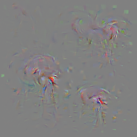

Synthesize Optimal Image
========================

There is an example to synthesize the image which can extract the
highest activation of target unit. In this example we will get optimal
image of channel 131 in layer fc3, which is responsible for flamingo
category. There will be many detailed annotations in code.

Code
----

::

   # import library
   import os
   from os.path import join as pjoin
   from dnnbrain.dnn.models import AlexNet
   from dnnbrain.dnn.algo import SynthesisImage
   from dnnbrain.dnn.base import ip

   # 0: Folds preparation
   path = os.getcwd()

   # 1:Parameter Set
   # 1.1 prepare target channel
       #First save your target channel in variable
   layer = 'fc3'
   chn = 131

   # 1.2 method
       # Next you can choose metrics for synthesizing,
       # you must decide how to compute the activation in 1.2.1
       # and for those in 1.2.2-1.2.4, they are optimal method
       # you can choose only one or combinations of many
       # which depends on your purpose and image quality.

   # 1.2.1 How to compute
       # Because channels in convolutional layers has more
       # than one activation value, we provide mean and max
       # to compute the activation loss function of activation
       # map, but for fully-connected(fc) layers, the activation
       # map only has one activation.
   act_meth = 'mean'

   # 1.2.2 Regularization
       # Loss function =  - activation + regularization
       # where activation is the mean or max of the channel
       # and regularization constraint additional requirement
       # on the image, usually dealing with outliers in pixels.
   reg_meth = 'TV' # Method name: total variance
   reg_lambda = 0.01 

   # 1.2.3 Image Precondition
       # This type of metrics processes the whole image in every
       # iteration, often blur the image to mitigate high frequency.
   pre_meth = 'GB' # Method name: gaussian blur
   GB_radius = 0.3

   # 1.2.4 Gradient Smooth
       # Gradient smooth works by smooth the gradient of activation,
       # gradient determines the output of image in every iteration.

   sm_meth = 'Fourier' # Method name: Fourier filter
   factor = 0.3

   #1.3 utiliz
       # If you want to see interim images in iteration,
       # or you want to know how loss function value changes
       # we provide method for such purpose

   #1.3.1 Save interval images in iteration 
       # Such method can help you know the evolution of
       # optimal image
   save_out_interval = True
   save_interval = 10 # every 10 iteration save one

   #1.3.2 Print when iterating
   print_inter_loss = True
   step = 10 # print loss every 10 iterations

   # Above are parameters available of SynthesisImage
   # following we will use some parameters to synthesize
   # the optimal image for fc3 131. Specifically, we
   # will use Total Variance.

   #2: Synthesize

   #Get Network
   dnn = AlexNet()

   #prepare parameters of optimizer
   lr = 0.1 #learning rate
   n_iter = 150 # number of iterations

   #create instance of SynthesisImage
   synthesis = SynthesisImage(dnn)

   #Set layer & channel
   synthesis.set_layer(layer, chn)

   #Set metric parameters
       # Note if you don't use some optimal ones,
       # you need to give 'None' value,
       # here we only adopt smooth_metric
       # but all the metrics should be set
   synthesis.set_loss_function(activ_metric='mean', regular_metric=reg_meth,regular_lambda=reg_lambda)
   synthesis.set_precondition(precondition_metric=pre_meth,GB_radius=GB_radius)                  
   synthesis.set_smooth_gradient(smooth_metric=sm_meth, factor=factor)

   #Set utiliz parameters
       # Here we set both to be True,
       # then essential parameters should be set
       # in synthesize()
   synthesis.set_utiliz_loss(print_inter_loss, step=step)
   synthesis.set_utiliz_save(save_out_interval, save_path=path, save_interval=save_interval)
   #start synthesize
       # In this example you can omit init_image & unit & factor & GB_radius if not necessary
   optimal_img = synthesis.synthesize(init_image=None, unit=None, lr=lr, regular_lambda=reg_lambda,
                                      n_iter=n_iter, GB_radius=GB_radius, factor=factor)

   # Save final images
   # name the image path
   file_name = f'optimal_{layer}_chn{chn}.png'
   file_path = pjoin(path, file_name)
   # transfer to Image
   img_out = ip.to_pil(optimal_img, True)
   # save in the current dir
   img_out.save(file_path)
   # you will see the png in your current path

The optimal image of flamingo is displayed as below:

.. raw:: html

   

|optimal|

.. raw:: html

   

Note: usually combinations pf metrics will produce much better quality,
but more parameters should be searched.

