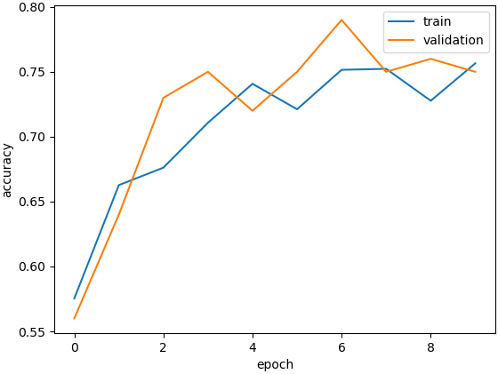

Train from Scratch
==================

In addition to transfer learning that trains a DNN based on its pretrained parameters, DNNBrain also supports training a DNN from scratch. Here, we demonstrate how to use DNNBrain to train a self-defined DNN.

Firstly, show all imports that used in this demonstration:

::

    import numpy as np
    import pickle as pkl
    
    from torch import nn
    from PIL import Image
    from os.path import join as pjoin
    from torchvision import transforms
    from torchvision import models as tv_models
    from dnnbrain.dnn.models import DNN
    from dnnbrain.dnn.core import Stimulus

And the self-defined DNN is looked like below:

::

    class Model(nn.Module):
        def __init__(self):
            super(Model, self).__init__()
            self.conv = nn.Conv2d(3, 8, kernel_size=3, stride=2)
            self.relu1 = nn.ReLU(inplace=True)
            self.maxpool = nn.MaxPool2d(kernel_size=3, stride=2)
            self.fc1 = nn.Linear(24200, 4096)
            self.relu2 = nn.ReLU(inplace=True)
            self.fc2 = nn.Linear(4096, 2)
        
        def forward(self, x):
            x = self.conv(x)
            self.relu1(x)
            x = self.maxpool(x)
            x = x.view(x.size(0), -1)
            x = self.fc1(x)
            self.relu2(x)
            x = self.fc2(x)
            return x

The DNN is designed to receive a tensor with shape as (n_sample, 3, 224, 224), and do binary classification.

We use training set and validation set of ants and bees from ImageNet2012. There are 1300 training images and 50 validation images for each class. The two sets of images are organized in **train.stim.csv** and **val.stim.csv** with their class labels and category names respectively. Then, we load them:

::

    # load training and validation data
    stim_train = Stimulus()
    stim_train.load('train.stim.csv')
    stim_val = Stimulus()
    stim_val.load('val.stim.csv')

For each image channel, we calculate the mean and standard deviation (std) among all training images. It will be used in data normalization.

::

    # get mean and std for normalization
    img_size = (224, 224)
    img_arr = np.zeros((len(stim_train), *img_size, 3))
    resize = transforms.Resize(img_size)
    for i, stim_id in enumerate(stim_train.get('stimID')):
        img = Image.open(pjoin(stim_train.header['path'], stim_id)).convert('RGB')
        img = resize(img)
        img_arr[i] = np.array(img)
    mean = img_arr.mean(axis=(0, 1, 2)) / 255
    std = img_arr.std(axis=(0, 1, 2)) / 255
    normalize = transforms.Normalize(mean=mean, std=std)

After finishing definition of model and preparation of data. There are two ways to encapsulate the model and operations that will be used during training. The first way is to build an instance of DNNBrain's DNN class and assign values to its attributes; The second is to derive a subclass from DNN class to rewrite attributes and even methods:

Building an instance of DNN class
---------------------------------

::

    # build an instance of DNN class
    dnn = DNN()
    dnn.model = Model()
    dnn.img_size = img_size
    dnn.train_transform = transforms.Compose([
        transforms.RandomResizedCrop(img_size),
        transforms.RandomHorizontalFlip(),
        transforms.ToTensor(),
        normalize
    ])
    dnn.test_transform = transforms.Compose([
        transforms.Resize(img_size),
        transforms.ToTensor(),
        normalize
    ])

Driving a subclass from DNN class
---------------------------------

::

    class MyDNN(DNN):
    
        def __init__(self):
            super(MyDNN, self).__init__()
            self.model = Model()
            self.img_size = img_size
            self.train_transform = transforms.Compose([
                transforms.RandomResizedCrop(img_size),
                transforms.RandomHorizontalFlip(),
                transforms.ToTensor(),
                normalize
            ])
            self.test_transform = transforms.Compose([
                transforms.Resize(img_size),
                transforms.ToTensor(),
                normalize
            ])
    
    
    dnn = MyDNN()

where "train_transform" defines how to transform training images to be input tensors, and "test_transform" defines how to transform testing images to be input tensors. In this case, "train_transform" will be used during training, and "test_transform" will be used when evaluating model's generalization on validation data at each epoch.

Everything is ready, we just call the "train" method of the DNN instance to start training. We set the number of epoch as 10. Finally, save out.

::

    # train the DNN
    train_dict = dnn.train(stim_train, 10, 'classification',
                           data_train=True, data_validation=stim_val)
	
    # save information of training process
    pkl.dump(train_dict, open('train_dict.pkl', 'wb'))
    
    # save parameters of the DNN
    dnn.save('my_model.pth')

The progress of prediction accuracy on training set and validation set are show as below:

