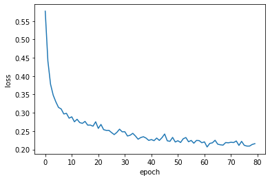
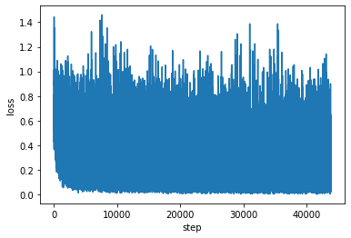
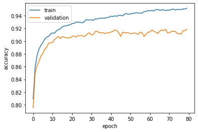

Transfer Learning
=================

Refer to `PyTorch transfer learning
tutorial <https://pytorch.org/tutorials/beginner/transfer_learning_tutorial.html>`__,
DNNBrain supports two major transfer learning scenarios: **finetuning**
and **fixed feature extractor**. Both of the two scenarios use a
pretrained DNN and replace the final fully connected (FC) layer with a
new one with random weights to do a new task.

For each scenario, we train the AlexNet for binary classification task
with 50 epochs as an example.

Scenario 1: finetuning
----------------------

In this scenario, all parameters will be trained.

::

   import torch
   import pickle as pkl

   from dnnbrain.dnn.models import AlexNet
   from dnnbrain.dnn.core import Stimulus

   # ---load training and validation data---
   stim_train = Stimulus()
   stim_train.load('train.stim.csv')
   stim_validation = Stimulus()
   stim_validation.load('validation.stim.csv')

   # ---replace the final FC layer with a new one---
   # initialize DNN
   dnn = AlexNet()
   # get the number of input features of the final FC layer
   n_in_feat = dnn.model.classifier[6].in_features
   # replacement
   dnn.model.classifier[6] = torch.nn.Linear(n_in_feat, 2)

   # ---train the DNN and save out---
   train_dict = dnn.train(stim_train, 50, 'classification', 
                          data_train=True, data_validation=stim_validation)
   
   # save information of training process
   pkl.dump(train_dict, open('train_dict.pkl', 'wb'))
   
   # save parameters of the retrained DNN
   dnn.save('alexnet_tl.pth')

Scenario 2: fixed feature extractor
-----------------------------------

In this scenario, only the last FC layer’s parameters will be trained.
Other parameters will be freezed.

::

   import torch
   import pickle as pkl

   from dnnbrain.dnn.models import AlexNet
   from dnnbrain.dnn.core import Stimulus

   # ---load training and validation data---
   stim_train = Stimulus()
   stim_train.load('train.stim.csv')
   stim_validation = Stimulus()
   stim_validation.load('validation.stim.csv')

   # ---replace the final FC layer with a new one---
   # initialize DNN and freeze pretrained parameters
   dnn = AlexNet()
   for param in dnn.model.parameters():
       param.requires_grad = False

   # get the number of input features of the final FC layer
   n_in_feat = dnn.model.classifier[6].in_features
   # replacement
   dnn.model.classifier[6] = torch.nn.Linear(n_in_feat, 2)

   # ---prepare optimizer---
   # set learning rate
   lr = 0.00001
   # set the number of epochs
   n_epoch = 50
   # pass the last FC layer's parameters to the optimizer
   optimizer = torch.optim.Adam(dnn.model.classifier[6].parameters(), lr)

   # ---train the DNN and save out---
   train_dict = dnn.train(stim_train, n_epoch, 'classification', optimizer,
                          data_train=True, data_validation=stim_validation)
   
   # save information of training process
   pkl.dump(train_dict, open('train_dict.pkl', 'wb'))
   
   # save parameters of the retrained DNN
   dnn.save('alexnet_tl.pth')

Plot information during training process
----------------------------------------

Some information during the training process will be returned and saved in :obj:`train_dict`, including the **loss of each epoch**, the **loss of each step**, and the **prediction score** on the **training data** and the **validation data** at the end of each epoch. :obj:`train_dict` is a :class:`dict`, and we can access these information according their keys as below:

plot loss of each epoch:

::

   from matplotlib import pyplot as plt
   
   plt.figure()
   plt.plot(train_dict['epoch_loss'])
   plt.xlabel('epoch')
   plt.ylabel('loss')
   plt.show()

plot loss of each step:

::

   step_losses = []
   for i in train_dict['step_loss']:
       step_losses.extend(i)
   
   plt.figure()
   plt.plot(step_losses)
   plt.xlabel('step')
   plt.ylabel('loss')
   plt.show()

plot prediction scores on training and validation data:

::

   plt.figure()
   plt.plot(train_dict['score_train'], label='train')
   plt.plot(train_dict['score_validation'], label='validation')
   plt.xlabel('epoch')
   plt.ylabel('accuracy')
   plt.legend()
   plt.show()

Reload the trained parameters
-----------------------------

::

   import torch
   
   from dnnbrain.dnn.models import AlexNet
   
   # ---replace the final FC layer with a new one---
   # initialize DNN
   dnn = AlexNet(False)
   # get the number of input features of the final FC layer
   n_in_feat = dnn.model.classifier[6].in_features
   # replacement
   dnn.model.classifier[6] = torch.nn.Linear(n_in_feat, 2)
   
   # ---load retrained parameters---
   dnn.model.load_state_dict(torch.load('alexnet_tl.pth'))
